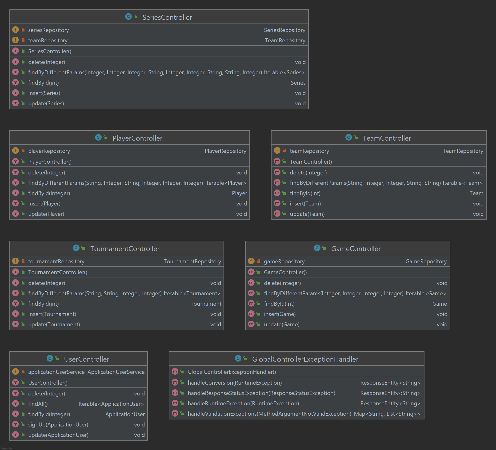

#RLCS

RLCS steh für Rocket League Championship Series und ist ein LAN Turnier das viermal im Jahr stattfinden. Sie werden nach den 4 Saison genannt zum Beispiel Fall Major oder Winter Split. Für dies habe ich eine API gemacht und diese beinhaltet einen Player, Team, Series, Game und Tournament Tabelle. Man kann alle CRUD methoden und kann bestimmte daten auch durch andere Fremdschlüssel zugreifen. Um die API zu benutzen, muss man sich zuerst anmelden und einloggen und dan muss man seinen Bearer token den man erhaltet in den body einfügen sonst kann man die API nicht benutzen. Man kann auch 72 verschiedene test ausführen die, die ganze API testet mit all ihren Funktionen.

